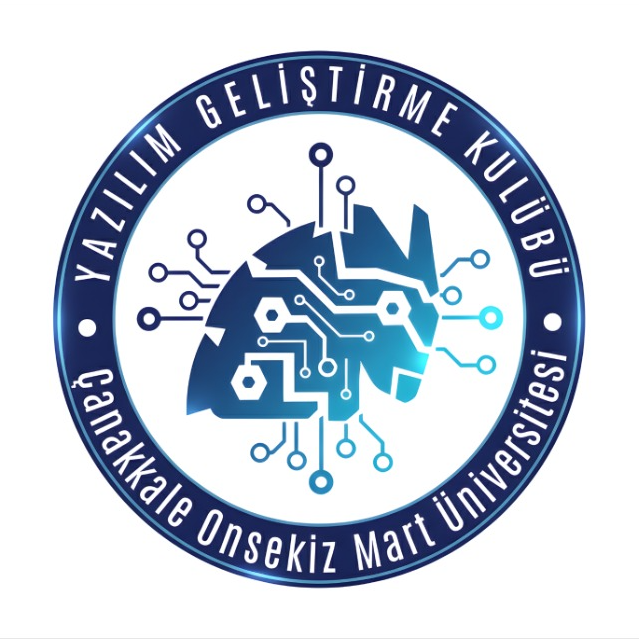
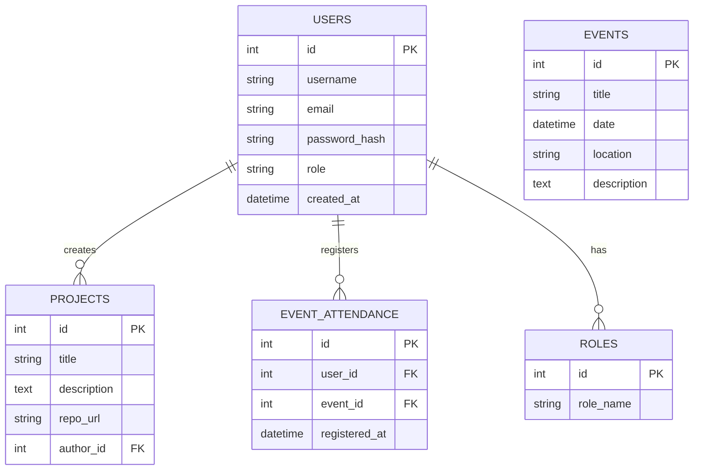

<div align="center">
  

  # 🚀 Yazılım Kulübü Web Sitesi

  **Modern, Dinamik ve Yenilikçi Topluluk Platformu**

  [](#)
  [](#)
  [](#)
  [](#)
  [](#)
</div>

<br/>

## 📖 Proje Hakkında (Ne İşe Yarar?)

**Yazılım Kulübü Web Sitesi**, üniversitemizdeki teknoloji ve yazılıma ilgi duyan öğrencileri bir araya getiren, kulüp etkinliklerini duyuran, projelerin sergilendiği ve üyelerin etkileşimde bulunmasını sağlayan kapsamlı bir açık kaynak platformdur.

Bu platform sayesinde:
- 📅 **Etkinlik Yönetimi:** Kulüp içi eğitimler, hackathonlar ve seminerler takip edilebilir.
- 💻 **Proje Vitrini:** Üyelerin geliştirdiği projeler ve başarılar herkesle paylaşılır.
- 🤝 **Üye Katılımı:** Yeni üyelerin kayıt olması ve kulüp kollarında görev alması kolaylaşır.
- 📰 **Duyurular:** Önemli haberler anında kullanıcılara iletilir.

---

## 📸 Arayüz & Teknoloji Yığını

Aşağıda projenin hem önyüzünde hem de arka planında kullanılan modern teknolojiler ve uygulama arayüzünden örnekler bulunmaktadır.

<p align="center">
  
  
  
  
  
  
</p>

### 💻 Ekran Görüntüleri ve GIF'ler

> **Uygulama İçi Görünüm (Örnek Demo)**
> <br/>
> 
> *(Yukarıdaki görsel projenin dinamik yapısını yansıtan bir animasyondur. İlgili kısımlara kendi uygulama içi GIF'lerinizi de sonradan ekleyebilirsiniz.)*

---

## 🗄️ Veri Tabanı Şeması

Aşağıda sistemin kullanıcıları, etkinlikleri ve projeleri arasındaki ilişkileri gösteren ER (Entity-Relationship) veritabanı şemasının görsel diyagramı yer almaktadır:


*(GitHub üzerinde bu kod bloğu otomatik olarak şık bir veritabanı görseline dönüşmektedir.)*

---

## 🚀 Yerelde Kurulum ve Çalıştırma

Projeyi geliştirme ortamınızda ayağa kaldırmak için aşağıdaki yöntemlerden birini seçebilirsiniz.

### Seçenek 1: Docker ile Hızlı Kurulum (Önerilen 🐳)

Docker ve Docker Compose kullanarak tüm bağımlılıkları (Veritabanı, Backend, Frontend) tek komutla başlatabilirsiniz:

```bash
# Projeyi klonlayın
git clone https://github.com/MuhammetFurkanErdem/yazilim-kulubu-website.git
cd yazilim-kulubu-website

# Docker Compose ile tüm servisleri ayağa kaldırın
docker-compose up --build
```
> Uygulama başarılı bir şekilde ayağa kalktıktan sonra **http://localhost:3000** (veya belirlenen port) üzerinden erişebilirsiniz.

### Seçenek 2: Manuel Kurulum (pip & npm)

Eğer Docker kullanmadan, ortamı tamamen kendiniz kurmak isterseniz:

**1. Backend Kurulumu:**
```bash
# Backend klasörüne gidin (varsa)
cd backend

# Sanal ortam oluşturun ve aktif edin
python -m venv venv
source venv/bin/activate  # Windows için: venv\Scripts\activate

# Gerekli kütüphaneleri yükleyin
pip install -r requirements.txt

# Veritabanı migrasyonlarını yapın ve API sunucusunu başlatın
python manage.py migrate
python manage.py runserver
```

**2. Frontend Kurulumu:**
```bash
# Ana dizine geri dönün
cd ..

# Bağımlılıkları yükleyin
npm install

# Geliştirme sunucusunu başlatın
npm run dev
```

---

## 🤝 Katkıda Bulunma

Bu proje tüm kulüp üyelerinin katkılarına açıktır! Nasıl katkıda bulunacağınız aşağıda açıklanmıştır:
1. Bu repoyu Fork'layın
2. Yeni bir branch oluşturun (`git checkout -b feature/YeniOzellik`)
3. Yaptığınız değişiklikleri commit'leyin (`git commit -m 'Harika bir özellik eklendi'`)
4. Branch'inizi push'layın (`git push origin feature/YeniOzellik`)
5. Bizim repomuza bir **Pull Request** açın!
